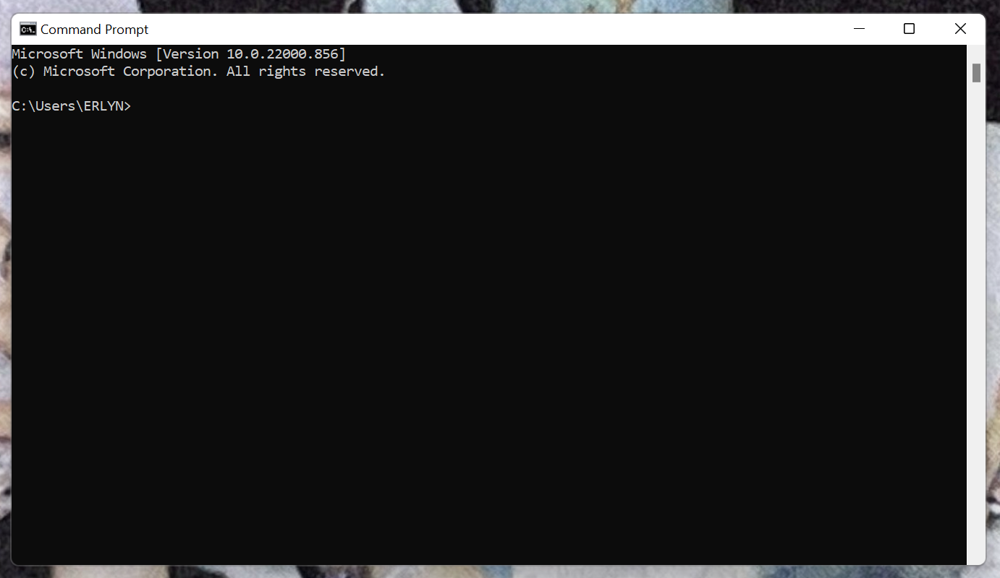

<h1 align="center"><b>Tugas 3 Sistem Operasi</b></h1>

Nama | Nim | Mata Kuliah | Dosen Pengampu
---|---|---|---
Adelia Erlyn N.C.P. | 2110131320010 | Sistem Operasi | Dr. Harja Santanapurba, M.Kom / Novan Alkaf B. S. S.Kom., M.T

<hr>

_**Deskripsi Tugas**_ <br>

<hr><br>

```
1. Pelajari topik Komponen Sistem Operasi, Layanan Sistem Operasi  dan Sistem Call
2. Berikan minimal 3 contoh untuk  setiap (1) komponen sistem operasi, (2) layanan sistem operasi serta (3) system call yang ada pada komputer kalian.
3. Contoh berupa screenshot yang ada di Sistem Operasi Kalian. Kemudian berikan penjelasan.
4. Contohnya ada manajemen file berkas, maka contohnya adalah cara membuat folder. Buatlah tutorial membuat folder disertai screenshot di laptop kalian. 
5. Screenshot contoh ini bisa menggunakan OS Windows atau OS Linux.
```

<br><hr>

<u>_**Penyelesaian Tugas**_ </u><br>
<hr><br>

## 1. Komponen Sistem Operasi

<br>

### _Manajemen Memori Utama (Windows Task Manager)_ 

<br>

<p align="center"></p>
<br>

<p align="justify">Pada task manager berguna untuk memantau proses aplikasi yang berjalan serta penggunaan memory pada setiap proses. Task manager dapat diakses dengan <b>ctrl + alt + del</b> atau klik kanan pada task bar lalu pilih task manager.

<br>

### _Manajemen berkas (File Explorer Windows)_

<br>

<p align="center"></p><br>

<p align="center"></p>
<br>

<p align="justify">Manajemen berkas pada windows dapat dengan mudah diakses dengan <b>klik kanan, pilih new, kemudian klik icon folder</b>. File manager berguna untuk mengelola, menghapus, membuat, atau menggandakan file yang ada di dalam sistem operasi.</p>

<br>

### _Command Interpreter system (Command Promt /CMD windows)_

<br>

<p align="center"></p><br>

<p align="center"></p>
<br>

<p align="justify">Command Prompt atau lebih dikenal dengan CMD adalah salah satu aplikasi command line interpreter (CLI) yang ada di sistem operasi Windows. Perintah CMD berfungsi untuk memberikan berbagai perintah kepada komputer tanpa perlu menavigasi program berbasis GUI seperti File Explorer, Control Panel, dan sebagainya. Command Prompt dapat diakses dengan <b>Buka pencarian, ketikan cmd, kemudian klik Command Prompt Open.</b></p>


